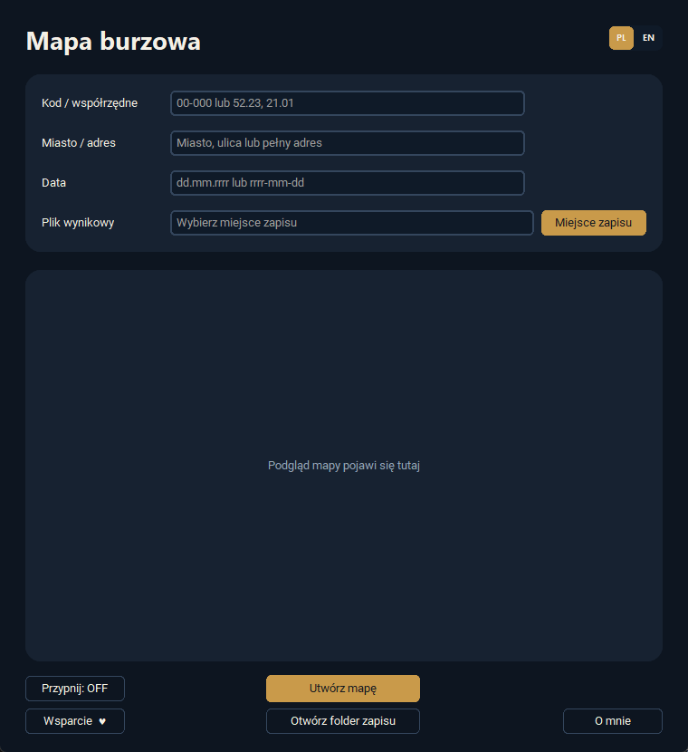

# Generator Mapy Burzowej

**Wersja 5.1.0 · Windows · aplikacja portable**

Generator Mapy Burzowej to praktyczne narzędzie umożliwiające szybkie przygotowanie mapy przedstawiającej aktywność burzową dla wybranej lokalizacji i określonego dnia. Program został stworzony z myślą o prostocie obsługi oraz zastosowaniach serwisowych, dokumentacyjnych, reklamacyjnych i biurowych.

Aplikacja działa w wersji portable, dlatego nie wymaga instalacji. Wystarczy uruchomić pobrany plik EXE, aby rozpocząć korzystanie z programu.



## Nowości w wersji 5.1.0

- pełne przełączanie interfejsu i komunikatów między językiem polskim i angielskim,
- osobne strony wsparcia dla wersji PL i EN,
- ujednolicony układ przycisków **Przypnij**, **Wsparcie ♥** i **O mnie**,
- odświeżony interfejs zgodny ze wspólnym standardem Petit Portable Software.

## Najważniejsze możliwości

- generowanie mapy aktywności burzowej dla wybranego dnia,
- oznaczanie lokalizacji czytelną pinezką,
- wyszukiwanie według pełnego adresu, miejscowości, kodu pocztowego, ulicy lub współrzędnych,
- automatyczne aktualizowanie nazwy pliku wynikowego po zmianie lokalizacji lub daty,
- natychmiastowe otwieranie folderu z zapisaną mapą,
- przypinanie okna nad pozostałymi aplikacjami,
- obsługa języków polskiego i angielskiego,
- działanie bez instalacji.

Do pobierania map i rozpoznawania lokalizacji wymagane jest połączenie z internetem. Program przyjmuje wyłącznie dni, dla których mapa jest już dostępna — najpóźniej dzień wczorajszy.

## Źródła danych

Program korzysta z dwóch zewnętrznych źródeł danych:

- **[OpenStreetMap](https://www.openstreetmap.org/)** — lokalizacja wpisana przez użytkownika jest rozpoznawana za pomocą geokodera **Nominatim**, działającego na danych OpenStreetMap,
- **[Burzowo.info](https://burzowo.info/)** — źródło map przedstawiających aktywność burzową dla wybranego dnia.

Podczas tworzenia mapy dane lokalizacji są wysyłane do usługi Nominatim w celu ustalenia współrzędnych, a wybrana data jest używana do pobrania odpowiedniej mapy z Burzowo.info.

## Prosta obsługa

Do wygenerowania mapy wystarczy podać lokalizację. Może to być pełny adres, sama miejscowość, kod pocztowy, nazwa ulicy albo współrzędne geograficzne. Program automatycznie rozpoznaje wprowadzone dane i przygotowuje czytelną mapę burzową dla wskazanego obszaru.

Po zmianie lokalizacji lub daty nazwa pliku w polu miejsca zapisu aktualizuje się automatycznie. Pozwala to sprawnie tworzyć kolejne mapy bez ręcznego poprawiania nazwy każdego pliku.

Po wygenerowaniu mapy można od razu otworzyć folder, w którym została zapisana. Plik jest dzięki temu szybko dostępny i gotowy do przesłania, wydrukowania lub dołączenia do dokumentacji.

Przycisk **Przypnij** utrzymuje okno aplikacji na pierwszym planie. Jest to szczególnie przydatne podczas równoczesnej pracy z systemem reklamacyjnym, pocztą, dokumentacją serwisową lub innymi aplikacjami.

## Zastosowanie w reklamacjach i diagnostyce poburzowej

Program może być szczególnie przydatny podczas rozpatrywania reklamacji urządzeń elektrycznych i elektronicznych, w których podejrzewa się uszkodzenie spowodowane burzą, przepięciem lub wyładowaniem atmosferycznym.

Wygenerowana mapa może stanowić dodatkowy materiał wspierający diagnostykę poburzową. Pozwala sprawdzić, czy w pobliżu wskazanej lokalizacji występowała aktywność burzowa w dniu, w którym doszło do awarii urządzenia.

Narzędzie może pomóc w:

- analizie prawdopodobnej przyczyny uszkodzenia,
- dokumentowaniu warunków pogodowych w czasie wystąpienia awarii,
- przygotowaniu materiałów do reklamacji lub zgłoszenia ubezpieczeniowego,
- ocenie, czy uszkodzenie mogło mieć związek z wyładowaniem atmosferycznym,
- usprawnieniu pracy serwisantów, instalatorów, pracowników biurowych i działów technicznych.

Generator Mapy Burzowej może przyspieszyć codzienną pracę z dokumentacją reklamacyjną. Zamiast ręcznie wyszukiwać dane i przełączać się między wieloma oknami, użytkownik może szybko wygenerować potrzebną mapę, otworzyć miejsce zapisu i dołączyć plik do zgłoszenia.

> Program nie zastępuje profesjonalnej ekspertyzy technicznej ani oficjalnych danych meteorologicznych. Stanowi narzędzie pomocnicze do wstępnej diagnostyki, przygotowywania dokumentacji oraz analizowania reklamacji związanych ze skutkami burz i przepięć.

## Uruchomienie kodu źródłowego

Wymagany jest Python oraz pakiety wymienione w `requirements.txt`.

```powershell
python -m pip install -r requirements.txt
python src/generator_mapy_burzowej.pyw
```

Kod korzysta między innymi z CustomTkinter, Pillow, Requests i geokodera Nominatim.

## Bezpieczeństwo wydań

Gotowe pliki EXE będą publikowane w sekcji GitHub Releases. Wydania mogą zawierać podpis cyfrowy oraz plik `SHA256SUMS.txt`, który pozwala sprawdzić integralność pobranego programu. Prywatne certyfikaty i ustawienia podpisywania nie są przechowywane w repozytorium.

## Wsparcie

Program jest udostępniany bezpłatnie i bez limitu czasu. W polskiej wersji przycisk **Wsparcie ♥** prowadzi do [BuyCoffee](https://buycoffee.to/beniamin-tv6), a w angielskiej do [Ko-fi](https://ko-fi.com/beniaminzak).
