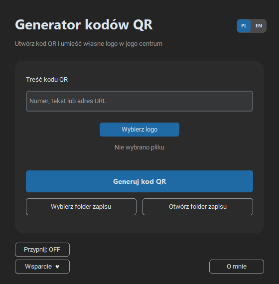

# Generator QR z Logo

**Wersja 4.8.0 · Windows · aplikacja portable**

Generator QR z Logo tworzy kody QR z tekstu, numeru lub adresu URL. Użytkownik może dodać własne logo do środka kodu, wybrać folder docelowy i natychmiast otworzyć miejsce zapisu.

Aplikacja jest przenośna i nie wymaga instalacji.



## Najważniejsze możliwości

- generowanie kodów QR z tekstu, numeru lub adresu URL,
- opcjonalne umieszczanie własnego logo w centrum kodu,
- wysoka korekcja błędów poprawiająca czytelność kodu z logo,
- wybór folderu zapisu przed utworzeniem pliku,
- natychmiastowe otwieranie folderu z wynikiem,
- podpis `dev. Headlost` umieszczany pod wygenerowanym kodem,
- pełny interfejs i komunikaty w języku polskim oraz angielskim,
- przypinanie okna nad pozostałymi aplikacjami,
- działanie lokalne bez połączenia z internetem.

## Sposób użycia

1. Wprowadź treść kodu QR.
2. Opcjonalnie wybierz plik z logo.
3. Wskaż folder zapisu.
4. Kliknij **Generuj kod QR** i wybierz nazwę pliku PNG.
5. Użyj przycisku **Otwórz folder zapisu**, aby przejść do wyniku.

## Prywatność

Kod QR i logo są przetwarzane lokalnie. Program nie przesyła treści kodu, pliku logo ani informacji o folderach do internetu.

## Uruchomienie kodu źródłowego

Wymagany jest Python oraz pakiety wymienione w `requirements.txt`.

```powershell
python -m pip install -r requirements.txt
python src/generator_qr_z_logo.pyw
```

## Bezpieczeństwo wydań

Gotowy EXE jest publikowany w [GitHub Releases](https://github.com/Headlost/Petit-Portable-Software/releases), podpisany cyfrowo certyfikatem `CN=Beniamin_Ƶak_Code_Signing` i udostępniany wraz z plikiem `SHA256SUMS.txt`.

Prywatne certyfikaty i klucze nie są przechowywane w repozytorium.

## Wsparcie

Program jest bezpłatny i nie ma limitu czasu. W polskiej wersji przycisk **Wsparcie ♥** prowadzi do [BuyCoffee](https://buycoffee.to/beniamin-tv6), a w angielskiej do [Ko-fi](https://ko-fi.com/beniaminzak).
