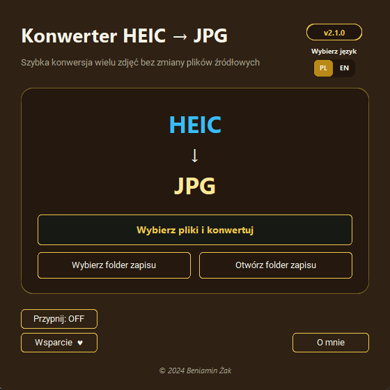

# Konwerter HEIC na JPG

**Wersja 2.1.0 · Windows · aplikacja portable**

Konwerter HEIC na JPG to proste narzędzie do szybkiej, zbiorczej konwersji zdjęć zapisanych w formacie HEIC do plików JPG. Program nie modyfikuje obrazów źródłowych i pozwala samodzielnie wskazać folder docelowy.

Aplikacja działa w wersji portable, dlatego nie wymaga instalacji. Wystarczy uruchomić pobrany plik EXE.



## Nowości w wersji 2.1.0

- dodano przycisk **Przypnij: OFF/ON**, który utrzymuje okno nad innymi aplikacjami,
- przycisk wsparcia otrzymał symbol serca,
- ujednolicono dolny pasek przycisków zgodnie ze standardem Petit Portable Software.

## Najważniejsze możliwości

- jednoczesna konwersja jednego lub wielu plików HEIC,
- zapisywanie plików JPG w wybranym folderze,
- domyślny zapis JPG obok pliku źródłowego, jeżeli nie wskazano innego miejsca,
- natychmiastowe otwieranie folderu z wynikami,
- zachowanie oryginalnych plików HEIC bez zmian,
- przypinanie okna nad pozostałymi aplikacjami,
- przełączanie całego interfejsu i komunikatów między językiem polskim i angielskim,
- osobne polskie i angielskie strony wsparcia,
- działanie lokalne bez połączenia z internetem,
- praca bez instalacji.

## Pobieranie

Gotowy program jest dostępny w sekcji [GitHub Releases](https://github.com/Headlost/Petit-Portable-Software/releases). Pobierz plik `Konwerter-HEIC-na-JPG.exe` i uruchom go w systemie Windows.

Przy pierwszym uruchomieniu, zależnie od ustawień systemu, może pojawić się komunikat Microsoft Defender SmartScreen. W takim przypadku kliknij **Więcej informacji**, a następnie **Uruchom mimo to**.

## Sposób użycia

1. Opcjonalnie kliknij **Wybierz folder zapisu**, aby wskazać wspólne miejsce dla plików JPG.
2. Kliknij **Wybierz pliki i konwertuj** i zaznacz jeden lub wiele obrazów HEIC.
3. Po zakończeniu użyj przycisku **Otwórz folder zapisu**, aby przejść do wyników.

Jeżeli folder docelowy nie zostanie wybrany, każdy plik JPG zostanie zapisany w folderze zawierającym odpowiadający mu plik HEIC.

## Prywatność

Konwersja odbywa się w całości lokalnie na komputerze użytkownika. Zdjęcia, nazwy plików ani informacje o wybranych folderach nie są przesyłane do internetu.

## Uruchomienie kodu źródłowego

Wymagany jest Python oraz pakiety wymienione w `requirements.txt`.

```powershell
python -m pip install -r requirements.txt
python src/konwerter_heic_na_jpg.pyw
```

Kod korzysta z bibliotek CustomTkinter, Pillow i Pillow HEIF.

## Bezpieczeństwo wydań

Gotowy program jest publikowany w sekcji GitHub Releases. Finalny plik EXE jest podpisany cyfrowo certyfikatem `CN=Beniamin_Ƶak_Code_Signing`, a do wydania dołączony jest plik `SHA256SUMS.txt` pozwalający sprawdzić jego integralność.

Prywatne certyfikaty, klucze i ustawienia podpisywania nie są przechowywane w repozytorium.

## Wsparcie

Program jest udostępniany bezpłatnie i bez limitu czasu. W polskiej wersji rozwój projektów można dobrowolnie wesprzeć przez [buycoffee.to/beniamin-tv6](https://buycoffee.to/beniamin-tv6), a w angielskiej przez [ko-fi.com/beniaminzak](https://ko-fi.com/beniaminzak).
