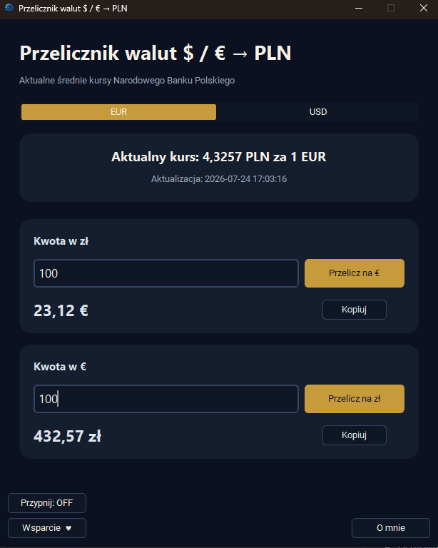

# Przelicznik walut na PLN

**Wersja 4.0.0 · Windows · aplikacja portable**

Przelicznik walut na PLN to niewielkie narzędzie do szybkiego przeliczania euro (EUR) i dolarów amerykańskich (USD) na złote oraz złotych na wybraną walutę. Program korzysta z ostatnich opublikowanych średnich kursów Narodowego Banku Polskiego.

Aplikacja działa w wersji portable, dlatego nie wymaga instalacji. Wystarczy pobrać i uruchomić plik EXE.



## Najważniejsze możliwości

- przeliczanie euro (EUR) i dolarów amerykańskich (USD) na złote,
- przeliczanie złotych na EUR lub USD,
- **prezentowanie kursów walut z dokładnością do czterech miejsc po przecinku,**
- automatyczne zaokrąglanie przeliczonych kwot do dwóch miejsc po przecinku,
- automatyczne pobieranie ostatniego opublikowanego średniego kursu NBP,
- szybkie przełączanie między EUR i USD,
- prezentowanie daty aktualności danych,
- informowanie o kursach pochodzących z ostatniego dnia roboczego,
- kopiowanie obliczonej kwoty wraz z oznaczeniem odpowiedniej waluty **€ i $**,
- możliwość wklejania skopiowanej wartości między innymi do kalkulatora — oznaczenie waluty nie zakłóca dalszych obliczeń,
- przypinanie okna nad pozostałymi aplikacjami,
- praca bez instalacji.

## Pobieranie kursów

Połączenie z internetem jest potrzebne do pobrania aktualnych kursów. Jeżeli NBP nie opublikował nowej tabeli, na przykład podczas weekendu lub dnia wolnego, program wykorzystuje ostatni dostępny kurs i informuje, że kolejna aktualizacja nastąpi w najbliższy dzień roboczy.

W przypadku braku połączenia program wyświetla ostrzeżenie i korzysta z jawnie oznaczonego kursu awaryjnego.

## Źródło danych i prywatność

Program korzysta z [Web API Narodowego Banku Polskiego](https://api.nbp.pl/) i pobiera ostatnie opublikowane średnie kursy EUR oraz USD z tabeli A.

Do API NBP wysyłany jest wyłącznie kod wybranej waluty. Wprowadzane kwoty nie są przesyłane do internetu — wszystkie obliczenia wykonywane są lokalnie na komputerze użytkownika.

## Uruchomienie kodu źródłowego

Wymagany jest Python oraz pakiety wymienione w `requirements.txt`.

```powershell
python -m pip install -r requirements.txt
python src/przelicznik_walut_na_pln.pyw
```

## Bezpieczeństwo wydań

Gotowe pliki EXE są publikowane w sekcji GitHub Releases. Finalny program jest podpisany cyfrowo certyfikatem `CN=Beniamin_Ƶak_Code_Signing`, a do wydania dołączony jest plik `SHA256SUMS.txt` pozwalający sprawdzić integralność pobranego pliku.

Prywatne certyfikaty, klucze i ustawienia podpisywania nie są przechowywane w repozytorium.

## Ważna informacja

Program korzysta ze średnich kursów informacyjnych publikowanych przez NBP. Wyniki mogą różnić się od kursów kupna i sprzedaży stosowanych przez banki, kantory oraz operatorów płatności.

Program nie stanowi porady finansowej i powinien być traktowany jako wygodne narzędzie pomocnicze.

## Wsparcie

Program jest udostępniany bezpłatnie i bez limitu czasu. Jeżeli doceniasz moją pracę, możesz dobrowolnie wesprzeć rozwój projektów przez przycisk **Wsparcie ♥** w lewym dolnym rogu aplikacji lub [postawić kawę](https://buycoffee.to/beniamin-tv6).
