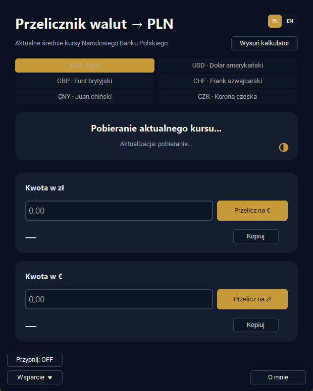
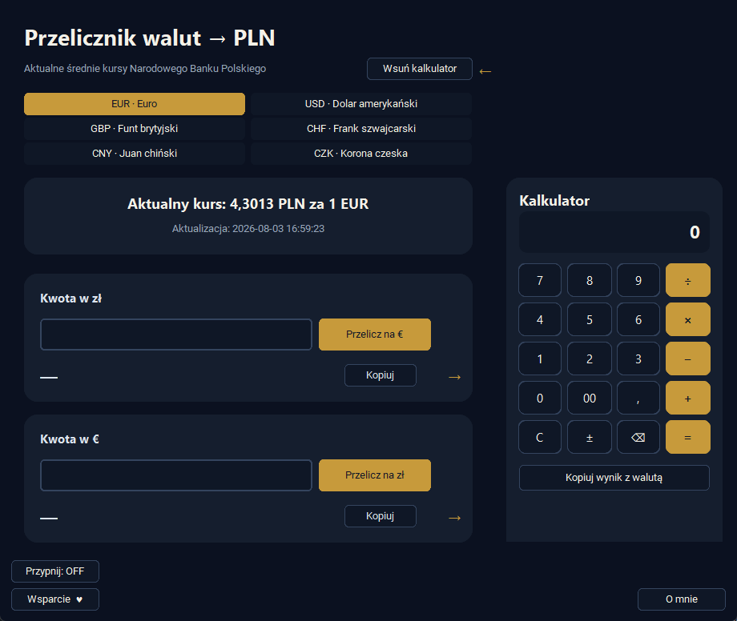

# Przelicznik walut na PLN

**Wersja 4.7.0 · Windows · aplikacja portable**

Przelicznik walut na PLN pozwala szybko przeliczać euro (EUR), dolary amerykańskie (USD), funty brytyjskie (GBP), franki szwajcarskie (CHF), juany chińskie (CNY) i korony czeskie (CZK) na złote oraz złote na wybraną walutę. Program korzysta z ostatnich opublikowanych średnich kursów Narodowego Banku Polskiego i zawiera wysuwany kalkulator.

Aplikacja działa w wersji portable, dlatego nie wymaga instalacji.



## Nowości w wersji 4.7.0

- pełne przełączanie interfejsu, kalkulatora i komunikatów między językiem polskim i angielskim,
- osobne strony wsparcia dla wersji PL i EN,
- ujednolicony układ przycisków **Przypnij**, **Wsparcie ♥** i **O mnie**,
- formatowanie liczb dopasowane do wybranego języka.

## Najważniejsze możliwości

- przeliczanie EUR, USD, GBP, CHF, CNY i CZK na złote,
- przeliczanie złotych na dowolną z sześciu obsługiwanych walut,
- **prezentowanie kursów walut z dokładnością do czterech miejsc po przecinku,**
- automatyczne zaokrąglanie przeliczonych kwot do dwóch miejsc po przecinku,
- automatyczne pobieranie ostatnich opublikowanych średnich kursów NBP,
- szybkie przełączanie walut za pomocą selektora w trzech rzędach,
- prezentowanie daty aktualności danych i informowanie o kursach z ostatniego dnia roboczego,
- kopiowanie kwoty wraz z oznaczeniem waluty: **€, $, £, CHF, ¥, Kč lub zł**,
- przełączanie całego interfejsu i komunikatów między językiem polskim i angielskim,
- przypinanie okna nad pozostałymi aplikacjami,
- praca bez instalacji.

## Wbudowany kalkulator

Wysuwany panel pozwala wykonywać podstawowe działania bez opuszczania programu oraz:

- bezpośrednio przekazywać i sumować przeliczone kwoty,
- obsługiwać działania za pomocą klawiatury numerycznej,
- kopiować wynik wraz z oznaczeniem waluty,
- korzystać z przewijanej historii i kopiować wcześniejsze wyniki.



## Pobieranie

Gotowy program jest dostępny w sekcji [GitHub Releases](https://github.com/Headlost/Petit-Portable-Software/releases). Pobierz plik `Przelicznik-walut-na-PLN.exe` i uruchom go w systemie Windows.

Przy pierwszym uruchomieniu, zależnie od ustawień systemu, może pojawić się komunikat Microsoft Defender SmartScreen. W takim przypadku kliknij **Więcej informacji**, a następnie **Uruchom mimo to**.

## Pobieranie kursów

Połączenie z internetem jest potrzebne do pobrania aktualnych kursów. Jeżeli NBP nie opublikował nowej tabeli, na przykład podczas weekendu lub dnia wolnego, program wykorzystuje ostatni dostępny kurs i informuje, że kolejna aktualizacja nastąpi w najbliższy dzień roboczy.

W przypadku braku połączenia program wyświetla ostrzeżenie i korzysta z jawnie oznaczonego kursu awaryjnego właściwego dla wybranej waluty.

## Źródło danych i prywatność

Program korzysta z [Web API Narodowego Banku Polskiego](https://api.nbp.pl/) i pobiera ostatnie opublikowane średnie kursy EUR, USD, GBP, CHF, CNY oraz CZK z tabeli A.

Do API NBP wysyłany jest wyłącznie kod wybranej waluty. Wprowadzane kwoty nie są przesyłane do internetu — wszystkie obliczenia wykonywane są lokalnie na komputerze użytkownika.

## Uruchomienie kodu źródłowego

Wymagany jest Python oraz pakiety wymienione w `requirements.txt`.

```powershell
python -m pip install -r requirements.txt
python src/przelicznik_walut_na_pln.pyw
```

## Bezpieczeństwo wydań

Gotowe pliki EXE są publikowane w sekcji GitHub Releases. Finalny program jest podpisany cyfrowo certyfikatem `CN=Beniamin_Ƶak_Code_Signing`, a do wydania dołączony jest plik `SHA256SUMS.txt` pozwalający sprawdzić integralność pobranego pliku.

Prywatne certyfikaty, klucze i ustawienia podpisywania nie są przechowywane w repozytorium.

## Ważna informacja

Program korzysta ze średnich kursów informacyjnych publikowanych przez NBP. Wyniki mogą różnić się od kursów kupna i sprzedaży stosowanych przez banki, kantory oraz operatorów płatności.

Program nie stanowi porady finansowej i powinien być traktowany jako wygodne narzędzie pomocnicze.

## Wsparcie

Program jest udostępniany bezpłatnie i bez limitu czasu. W polskiej wersji przycisk **Wsparcie ♥** prowadzi do [BuyCoffee](https://buycoffee.to/beniamin-tv6), a w angielskiej do [Ko-fi](https://ko-fi.com/beniaminzak).
