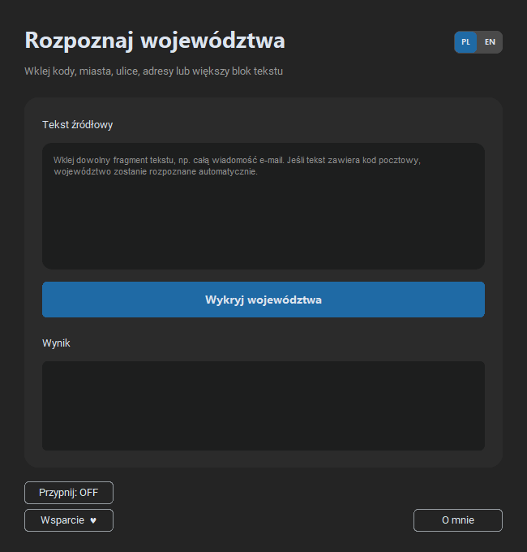

# Rozpoznawanie województw

**Wersja 2.6.0 · Windows · aplikacja portable**

Program rozpoznaje polskie województwa na podstawie kodów pocztowych, miejscowości i adresów znalezionych w dowolnym fragmencie tekstu. Można wkleić między innymi pełną wiadomość e-mail — obecność kodu pocztowego wystarczy do automatycznego wskazania województwa.

Aplikacja jest przenośna i nie wymaga instalacji.



## Najważniejsze możliwości

- wyszukiwanie kodów pocztowych w większym bloku tekstu,
- rozpoznawanie zapisu `00-000`, `00 000` i `00000`,
- wykrywanie województwa z nazwy miejscowości lub adresu,
- prezentowanie wielu województw, gdy tekst zawiera kilka lokalizacji,
- wyblakła podpowiedź w polu tekstowym zawijana według całych słów,
- pełny interfejs i komunikaty w języku polskim oraz angielskim,
- przypinanie okna nad pozostałymi aplikacjami,
- praca bez instalacji.

## Sposób użycia

1. Wklej dowolny fragment tekstu do pola **Tekst źródłowy**.
2. Kliknij **Wykryj województwa**.
3. Odczytaj rozpoznane województwo lub listę województw w polu wynikowym.

## Dane i prywatność

Kody pocztowe są analizowane przez bibliotekę pgeocode. Przy rozpoznawaniu miejscowości i pełnych adresów program może korzystać z geokodera Nominatim, dlatego dla tych zapytań może być wymagane połączenie z internetem. Do geokodera trafiają wyłącznie wybrane fragmenty służące do rozpoznania lokalizacji.

## Uruchomienie kodu źródłowego

Wymagany jest Python oraz pakiety wymienione w `requirements.txt`.

```powershell
python -m pip install -r requirements.txt
python src/rozpoznawanie_wojewodztw.pyw
```

## Bezpieczeństwo wydań

Gotowy EXE jest publikowany w [GitHub Releases](https://github.com/Headlost/Petit-Portable-Software/releases), podpisany cyfrowo certyfikatem `CN=Beniamin_Ƶak_Code_Signing` i udostępniany wraz z plikiem `SHA256SUMS.txt`.

Prywatne certyfikaty i klucze nie są przechowywane w repozytorium.

## Wsparcie

Program jest bezpłatny i nie ma limitu czasu. W polskiej wersji przycisk **Wsparcie ♥** prowadzi do [BuyCoffee](https://buycoffee.to/beniamin-tv6), a w angielskiej do [Ko-fi](https://ko-fi.com/beniaminzak).
